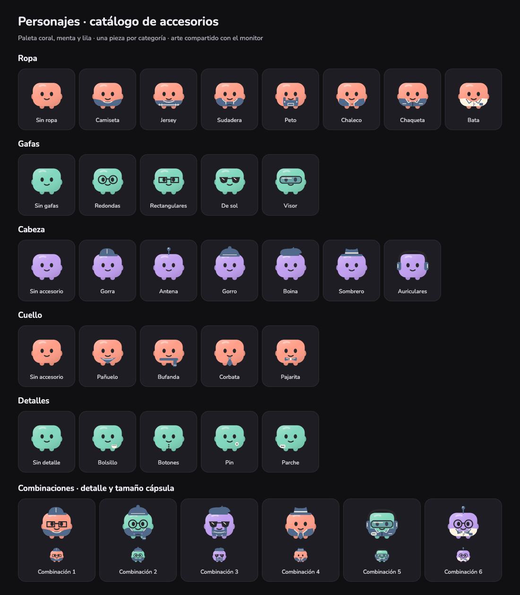

# Companion wardrobe

Owner-approved extension of Agents → Personalizar, 2026-10-08. The editor uses
six compact categories: Body, Clothing, Glasses, Head, Neck and Details. Each
wardrobe choice shows the actual shared character artwork with its Spanish label;
the upper-left selected portrait is the only live combination preview. The
owner removed the explanatory chat/model paragraph. No new main navigation view.

## Catalogue

| Slot | Selectable artwork, besides None |
| --- | --- |
| Clothing | T-shirt, sweater, hoodie, overalls, vest, jacket, lab coat |
| Glasses | Round, rectangular, sunglasses, visor |
| Head | Cap, antenna, beanie, beret, hat, headphones |
| Neck | Bandana, scarf, tie, bow tie |
| Detail | Pocket, buttons, pin, patch |

These are 25 pieces across five compatible slots. One choice per slot; None
removes only that piece. Nine curated colors remain available for body and
accessories. All accessory slots share the accessory color; the lab coat and
small contrast marks use fixed cream/ink for readability. Extra color controls
and arbitrary imported SVG/HTML are not introduced.

## Artwork and rendering

`monitor-ui/characters.js` contains original vector wardrobe drawings. These
are character artwork; product action icons continue to use bundled Lucide.
Every shared avatar, editor thumbnail and capsule uses the same renderer.
Clothing/detail layers clip to the rounded body and stay below the face; neck,
head and glasses follow the same animated body. Layer order is clothing, detail,
neck, head, glasses. Tiny details can be less visible in the capsule; the larger
clothing/head/glasses silhouette preserves identity. Thumbnail motion is disabled
and selected items have both a visible border and an accessible pressed state.

## Storage and compatibility

The existing private version-1 appearance document remains per stable agent ID.
Canonical slots are `outfit`, `glasses`, `head`, `neck`, `detail`. `glasses` now
uses a style ID. Legacy booleans normalize to rectangular/none; legacy `scarf`
normalizes to scarf/none. Missing new slots become None. Reading does not rewrite
owner data; Save writes only the selected agent. Unknown choices reject writes.
Atomic locking, independent identities, draft/cancel/reset, failure retention and
correlated native acknowledgements remain unchanged.

Shared schema/UI code runs on all three platforms. Windows' local asset route
and the read-only loopback preview explicitly include `characters.js`; Mac/Linux
packagers already copy the full UI directory. Native Windows/Linux execution is
still a separate acceptance gate. New live activity/animation states remain in
the [event proposal](COMPANION-EDITOR-PROPOSAL.md), outside this wardrobe change.
