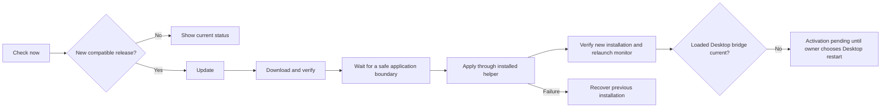

# Public distribution and managed updates — 2026-10-09

## Owner decisions

The owner selected the canonical source repository itself as the public release
channel, accepted GitHub's platform fork rights, and chose free personal,
noncommercial use with private modifications allowed and no general
redistribution permission. Original source remains visible for study. This is
source-available software, not open-source or unrestricted free software.
The root [license](../LICENSE) implements these choices; third-party rights are
preserved by [the notices](../THIRD_PARTY_NOTICES.md).

The repository was still PRIVATE during preparation. On 2026-10-09 the owner
explicitly authorized committing and pushing all current project changes directly
to remote main, including the license, brand, companion animations and interface
work. Use local HEAD and remote main to identify the delivery revision. Publishing
source does not itself change repository visibility or create a release.

GitHub's [repository licensing guide](https://docs.github.com/en/repositories/managing-your-repositorys-settings-and-features/customizing-your-repository/licensing-a-repository)
and [Terms of Service section D.5](https://docs.github.com/en/site-policy/github-terms/github-terms-of-service#5-license-grant-to-other-users)
explain the platform fork rights. The [Open Source Definition](https://opensource.org/osd)
requires redistribution and derived-work rights, which this license restricts.
No legal enforceability review is asserted for the project-specific license.

## Repository visibility prerequisites

1. Publish the selected license/notices and an accurate README with the complete
   owner-authorized source change set. Keep private runtime data outside Git.
2. Review all reachable repository history, branches/tags, GitHub Actions logs
   and downloadable artifacts that would become public. Scan output must contain
   safe metadata only. Pattern matches are review candidates, not proof of a leak;
   no matches are not proof that all private data is absent. Do not delete history
   or CI records without separate authorization.
3. The owner-approved original routing brand now replaces the third-party Codex
   icon in current source/packages. See [assets/README.md](../assets/README.md).
   Historical third-party images remain in Git history and still need exposure
   review; the root license cannot supply third-party rights. Do not rewrite or
   delete history without explicit authorization.
4. Change the canonical repository's visibility only after the conflicting
   licensing expectations and public-exposure prerequisites are resolved. Build
   installers as a separate delivery stage; making source public does not claim
   that trusted installers or managed updates are ready.

## Installer distribution prerequisites

Verify bundled runtime/dependency notices and publisher authentication for the
exact installers. No Apple Developer account or paid signing enrollment has been
approved or provisioned. Ad-hoc signing and SHA-256 integrity alone do not
establish publisher authenticity. This installer gate is separate from repository
visibility. Build from an immutable release revision and publish all supported OS
assets to a draft GitHub Release before promoting a complete stable release.

## Approved user flow; implementation still pending

The owner explicitly selected **Check now → newer version → Update** in Settings.
Clicking Update should start download, verification and installation as one
managed operation. The monitor closes only after verification and installation
preflight succeed; it relaunches automatically after application of the update.
No checkout, build tools, terminal, manually downloaded installer or manual
monitor close/reopen should be required for an installed end user.

Current `updates.py` implements discovery and integrity-checked staging only.
It does not execute installers (`canInstall=false`). Opt-in daily checking is
implemented; silent background installation has not been selected. Initial
implementation should keep the explicit Update button. OS authorization dialogs
may be required; do not advertise a completely prompt-free update.

## Shared lifecycle and native responsibilities

- The shared engine owns update state, compatibility, progress, cancellation,
  locking, safe receipts and recovery decisions. An installation-owned helper
  validates publisher identity and rechecks bytes immediately before execution.
  Do not execute helper code supplied by the downloaded artifact as the trust gate.
- Cancellation before apply removes partial staging and leaves the running
  installation untouched. Once an OS installer has crossed its commit boundary,
  do not kill it to emulate cancellation; complete or recover and show the result.
- Preserve the independent user-data root, settings, credential handles, task
  modes and telemetry. Backup/version retention must not export private data or
  delete the previous recoverable installation prematurely.
- macOS needs graphical legacy import/connection transfer and packaged runtime
  installation. The owner's current installation remains source-backed; developing
  in the checkout must stay separate from using the eventual packaged app.
- Windows uses the existing per-user version directories and recovery pointer;
  Ubuntu uses native package-manager transactions and dependency handling. Native
  privilege and file-in-use behavior remains platform-specific.
- Monitor relaunch and Desktop bridge activation are separate. Preserve active
  Desktop sessions; never silently terminate Desktop or active agents. When bridge
  compatibility requires it, show activation pending and let the owner choose
  when to restart Desktop.

## Release naming gap and acceptance

The existing updater consumes exact names listed in
[INSTALLATION-UPDATES.md](INSTALLATION-UPDATES.md). macOS and Windows builders
already use that naming contract. Ubuntu currently produces
`codex-model-router_<version>-<revision>_all.deb`; release assembly must map this
to canonical per-target download names for targets actually validated, retaining
the package's true Debian architecture and dependency metadata. Publishing an
`all` Debian package does not establish physical ARM acceptance.

Each OS needs a native record for fresh install, old-to-new upgrade, cancellation,
network/integrity/authenticity failure, interrupted installation/recovery, retained
credentials/preferences/metrics and automatic monitor relaunch. Test missing
prerequisites, unavailable privileges and concurrent update attempts. Source,
build, installed, loaded bridge and physical owner acceptance remain separate.
Use [NATIVE-VALIDATION.md](NATIVE-VALIDATION.md) and the receipt template.

## Verified preparation in this checkout

- The license and third-party notices are prepared locally. macOS/Windows/Ubuntu
  package builders and the legacy Windows ZIP copy an explicit set of four legal
  files; missing/unsafe inputs abort the copy before it writes any notices.
- 20 focused Python tests PASS: snapshot/relocation, exact license retention,
  missing/symlink rejection, generated Ubuntu payload notices and existing updater
  integrity/cancellation/compatibility behavior. The Ubuntu package-tool calls are
  substituted in this Mac fixture; it is not native APT or installer acceptance.
  Changed Python modules compile; `git diff --check` passes. No new native Mac or
  Windows installer execution is claimed.
- An obsolete Windows lifecycle fixture path was corrected from
  `installer/windows.iss` to `tools/packaging/windows.iss`; native fixture execution
  on Windows remains required.
- Read-only exposure review covers 1,421 reachable historical blobs (36,589,140
  bytes), all 12 current remote branch/tag heads, 58 accessible Actions log ZIPs
  and 21 accessible Actions artifacts. The selected credential patterns and
  private-file-name checks found no matches. The artifacts include 20 images
  generated by the Windows self-test workflow; they have not been visually
  reviewed in this preparation. This is a bounded preliminary scan, not a full
  privacy/secret certification. Raw archives and contents are not committed.
- The preparation checks above did not change repository visibility, create a
  release/tag, replace an installation, restart Desktop or provision signing keys.
  The owner subsequently authorized direct-main source publication; see the
  delivery entry in [HANDOFF.md](HANDOFF.md).
