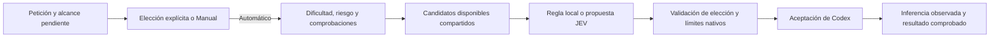

# Revisión Luna, Sol, Astra y JEV — 02/10/2026

Actualización: el propietario aprobó la propuesta y se implementó la
[comparación de política 9](POLICY9-VALIDATION.md). Los resultados históricos
siguientes se mantienen; implementar el comparador no demuestra calidad ni ahorro.

La sospecha tiene fundamento en la política del Mac: Astra se usa con frecuencia
y el motor local impide que JEV pruebe alternativas. Todavía no está demostrado
que todas esas decisiones sean innecesarias: las muestras carecen de calidad
etiquetada e inferencias confirmadas. La recomendación es ampliar el trabajo que
pueden asumir Luna y Sol y comprobarlo con tareas equivalentes antes de activar
otra política. Esta revisión no cambia la política 8 ni la configuración personal.

## Modelos y coste verificados

Los identificadores actuales son `gpt-6-luna`, `gpt-6.1-sol` y `gpt-6-astra`.
Las fuentes oficiales consultadas no identifican un `gpt-6.1-luna`.
El `model/list` del app-server instalado confirma los tres identificadores:
Luna admite Low/Medium/High/XHigh/Max, y Sol/Astra también Ultra. Esta consulta
no pidió inferencia ni modificó conversaciones. Ultra no forma parte de esta
propuesta de coste y no debe activarse automáticamente.
OpenAI recomienda Sol 6.1 para programación y trabajo complejo repetido con
restricciones de coste, Luna para trabajo enfocado y repetible, y Astra para
el trabajo más exigente. Eso orienta la selección, pero no demuestra una tasa
de éxito en este repositorio. [OpenAI Docs: modelos](https://learn.chatgpt.com/docs/models).

| Modelo | Uso recomendado para ensayar aquí | Esfuerzo de partida |
| --- | --- | --- |
| Luna 6 | Extracción, transformaciones, comprobaciones acotadas y cambios pequeños con criterios claros | Low para texto sencillo; High para código/comprobaciones; XHigh si hay razonamiento acotado |
| Sol 6.1 | Implementación habitual y compleja, integraciones, depuración, refactorización, diseño y accesibilidad verificables | Medium para alcance claro; High/XHigh para varias dependencias o evidencia contradictoria |
| Astra 6 | Incidentes con consecuencias graves, auditoría adversarial, problemas excepcionalmente difíciles o fallos de Sol comprobados | Según la dificultad actual; no Max por continuar la tarea |

Esta matriz es una **propuesta para experimentar**. La guía oficial admite Luna
con más razonamiento para problemas con restricciones claras y Sol para trabajo
técnico complejo y decisiones con fuentes contradictorias. No define umbrales
automáticos universales. [OpenAI Docs: selección](https://learn.chatgpt.com/docs/model-selection).

Tarifas publicadas a velocidad Standard, por millón de tokens; entrada sin caché
y contexto corto para las cifras API:

| Modelo | API entrada / salida, USD | Codex entrada / caché / salida, créditos |
| --- | --- | --- |
| Luna 6 | 0,10 / 0,50 | 2,5 / 0,25 / 12,5 |
| Sol 6.1 | 2 / 10 | 50 / 2,5 / 250 |
| Astra 6 | 10 / 50 | 250 / 25 / 1.250 |

Fuentes: fichas API de [Luna](https://developers.openai.com/api/docs/models/gpt-6-luna),
[Sol](https://developers.openai.com/api/docs/models/gpt-6.1-sol),
[Astra](https://developers.openai.com/api/docs/models/gpt-6-astra) y
[tarifas de créditos](https://learn.chatgpt.com/docs/pricing#token-rates).
La tarifa API no es la factura de Codex con suscripción. Fast, contexto largo,
caché y tokens adicionales de razonamiento cambian el coste aplicable.

Con idénticos tokens sin caché, Astra cuesta 5 veces Sol y Sol 20 veces Luna.
Por ejemplo, 10.000 tokens de entrada y 2.000 de salida a Standard equivalen a
0,05 / 1 / 5 créditos, respectivamente. Es una ilustración de tarifas, no el
consumo esperado de una tarea: un modelo puede generar más razonamiento,
necesitar reintentos o exigir más revisión humana.

## Qué muestran las instalaciones

Se leyó solo el historial crudo de decisiones como fuente de metadatos; no se
ejecutó código de los ZIP ni se guardó contenido privado en el informe.
Muestra Mac congelada a **15:57:32 UTC del 02/10/2026**. Ubuntu y Windows
proceden de los archivos entregados por el propietario. Cohortes 0.8.1:

| Instalación de recogida | Decisiones creadas/aceptadas | Astra | Luna | Sol |
| --- | --- | --- | --- | --- |
| Ubuntu | 52 | 3 (5,8 %) | 2 | 47 |
| Windows | 15 | 1 (6,7 %) | 0 | 14 |
| Mac | 109 | 37 (33,9 %) | 0 | 72 |
| Mac, últimas 50 | 50 | 18 (36 %) | 0 | 32 |

Las cohortes incluyen inicializaciones: 4 decisiones Ubuntu, 1 Windows y 4 Mac
no tienen evento de routing correspondiente. No representan todas elecciones
automáticas de JEV. Plataforma de recogida no demuestra plataforma histórica
de ejecución, y las cargas y ventanas no son comparables como experimento de SO.
En las tres muestras hay **0 inferencias confirmadas y 0 valoraciones de calidad**.
Estas proporciones describen modelos asignados/aceptados, no modelos que se haya
demostrado que respondieron.

De las 37 asignaciones Astra del Mac, 36 tienen suelo `critical`; 34 son
`planned_followup` y 2 `retry`. La restante carece de clasificación suficiente.
En las últimas 50, las 18 asignaciones Astra tienen suelo `critical`.
Es evidencia de un suelo heredado persistente; no identifica por sí sola el
motivo original ni demuestra que el riesgo ya estuviera resuelto.

Las últimas 50 parejas JEV/local tienen **0 diferencias de modelo**, pero
**19 diferencias de esfuerzo**: 16 reducciones y 3 aumentos. JEV añade una
mediana de 443 ms en esas llamadas; su calidad no está evaluada. Por tanto,
todavía puede aportar ajuste del razonamiento aunque casi no pueda elegir modelo.

JEV recibió 56.146 tokens de entrada y reportó 3.314 de salida en esa ventana.
Vercel publica entrada desde 0,04 USD por millón para Jev: el componente de entrada
equivale a unos 0,00225 USD según esa tarifa. No es coste facturado ni incluye una
tarifa de salida no publicada en esa ficha. [Jev en Vercel](https://vercel.com/ai-gateway/models/jev).
No se hicieron llamadas pagadas nuevas para este análisis.

## Diagnóstico del motor local

`routing.py`, `workload.py` y `model_catalog.py` muestran restricciones anteriores
a la capacidad de Sol 6.1 que merecen reevaluación:

- La banda normal tiene suelo/techo normal y corresponde a Sol. JEV no puede
  escoger Luna ni subir su razonamiento para un cambio pequeño con pruebas.
- `candidate_routes` ofrece Luna solo con Low/Medium, aunque el catálogo y la
  documentación contemplan High/XHigh/Max. Se estrecha artificialmente su uso.
- Un adjunto no textual puede elevar a Astra, sin distinguir un CSV de una
  referencia visual compleja. Presencia de adjuntos no mide dificultad.
- Accesibilidad/diseño amplio, refactorización «completa», investigación «profunda»
  y textos de más de 10.000 caracteres pueden establecer `critical` sin riesgo
  concreto. Longitud y palabras aisladas son aproximaciones frágiles.
- `merge_contract` conserva el suelo más alto mientras quede trabajo y solo lo
  baja con una reducción explícita del alcance. Un «adelante» puede prolongar
  Astra aun cuando queden pruebas o documentación. No debe borrarse un riesgo
  vigente, pero tampoco confundirse el modelo elegido con una necesidad actual.
- Un reintento desde banda compleja puede saltar a Astra. Un error de red,
  compilación o herramienta no demuestra incapacidad de Sol; hacen falta causas
  de fallo y comprobaciones, además del texto «sigue fallando».

El corpus anterior 27/27 comprueba conformidad con esas reglas. No demuestra que
la asignación sea la más económica que cumple la calidad requerida.

## Diagnóstico de JEV

JEV recibe candidatos filtrados por la política local. Con suelo `critical`,
todos son Astra: no existe una elección libre entre Astra y Sol. Cambiar solo sus
instrucciones no elimina esa restricción.

Además, las instrucciones aún dicen que Terra cubre cambios concretos aunque
la banda normal ya corresponde a Sol 6.1; no incluyen precios ni descripciones
actuales de Luna High y Sol 6.1. La respuesta válida se aplica sin un umbral
calibrado de confianza. Una probabilidad del clasificador no equivale a la
probabilidad de que el modelo complete bien el trabajo.

Propuesta: generar los candidatos a partir del alcance verificable, dificultad
y consecuencias actuales; compartir esa elegibilidad con el motor local y JEV.
Después, JEV podrá elegir modelo/esfuerzo con descripciones actuales y tarifas
de referencia, preservando los límites nativos. Su coste, latencia, cobertura de
tokens y resultado deben medirse frente al respaldo local sobre iguales entradas.
No desactivar JEV por observar acuerdo de modelo cuando casi no tuvo alternativas.

## Política recomendada y validación previa

1. Luna High para trabajo enfocado con comprobaciones objetivas; Low para texto
   sencillo. Permitir XHigh en problemas acotados antes de cambiar de familia.
2. Sol 6.1 como ruta habitual para ingeniería, y High/XHigh para complejidad real.
   Diseño, adjuntos o la palabra «completo» no deben imponer Astra por sí solos.
3. Astra para el trabajo excepcional y riesgo grave actual, solicitud explícita,
   o fallo de calidad de Sol demostrado por comprobaciones. Reevaluar el alcance
   pendiente sin rebajar riesgos cuya resolución no se haya verificado.
4. Separar dificultad/capacidad de consecuencias/controles. Un modelo más barato
   no concede permisos ni sustituye aprobaciones. Manual y elección explícita
   permanecen; cruzar hacia/desde Astra exige otro turno.

`python3 tests/review_model_policy.py` reproduce **12 casos sintéticos** contra
la política actual y sus candidatos JEV; identifica qué propuestas ni siquiera
pueden ensayarse con la elegibilidad actual. Las recomendaciones son etiquetas
de revisión, no una nueva política activada ni una medición de calidad.
En ese conjunto construido para explorar límites, la política actual asigna
Astra a 7 casos; la propuesta recomienda ensayarlo en 2 y reserva los otros
para alternativas verificables. Ocho combinaciones propuestas quedan fuera de
los candidatos actuales. Son elecciones de la revisión, no un porcentaje de
ahorro ni una estimación representativa del uso diario.

El siguiente experimento debe usar copias aisladas de los mismos fixtures,
comprobaciones predefinidas y una decisión terminal por brazo. Comparar Luna
High/XHigh contra Sol y Sol High/XHigh contra Astra en cambios acotados,
refactorización, debugging, accesibilidad y extracción con adjuntos. Registrar
corrección, fallos, revisión humana, reintentos, tiempo total y tokens del
clasificador. Usar `record-check` solo para comprobaciones realmente ejecutadas.
No sumar snapshots nativos sucesivos ni atribuir un coste por modelo sin
inferencia confirmada. Elegir el menor consumo que cumpla la barra de calidad.

## Propuesta concreta tras cerrar la investigación

**Recomendación: Sol 6.1 como base; Luna 6 para alcance acotado y comprobable;
Astra para dificultad excepcional, riesgo vigente o fallo de calidad demostrado.**
La investigación de documentación y política queda terminada. Lo que falta es
el experimento propio: todavía no se ha demostrado la calidad de la alternativa
ni se ha autorizado su activación con esta propuesta.

No fijaría una cuota de uso de Astra ni un porcentaje de ahorro. El objetivo es
consumo por tarea correctamente resuelta. Sol puede resolver trabajo complejo:
no debe equipararse «complejo» a «Astra obligatorio». La guía específica de
[selección actual](https://learn.chatgpt.com/docs/model-selection) recomienda
ensayar Sol 6.1 en proyectos complejos sensibles al coste. Otras
[guías generales de agentes](https://developers.openai.com/tracks/building-agents#how-to-choose)
aún usan ejemplos de modelos 5.6 y recomiendan Astra como referencia inicial.
Son recomendaciones de propósito distinto; ninguna mide estas tareas locales.

### 1. Una política común, con dificultad y riesgo separados

La clasificación produciría campos simbólicos: alcance acotado o abierto,
dificultad, comprobaciones disponibles, riesgo vigente, fase pendiente y causa
del último fallo. Su clasificación puede ser incierta; esa incertidumbre debe
quedar registrada. La presencia de un adjunto y palabras como «completo»,
«profundo», «audita» o «producción» no bastarían solas para elegir Astra.

| Situación | Respaldo local propuesto | Alternativas para ensayar con JEV |
| --- | --- | --- |
| Texto o transformación mecánica explícita | Luna Low | Luna Low/Medium |
| Cambio enfocado, contrato claro y comprobaciones objetivas | Luna High | Luna High/XHigh; Sol Medium/High |
| Ingeniería habitual, integración o alcance todavía incierto | Sol Medium/High | Sol Medium/High/XHigh |
| Depuración difícil, arquitectura, diseño o evidencia contradictoria | Sol High/XHigh | Sol High/XHigh; Astra si se justifica dificultad excepcional |
| Riesgo grave concreto, auditoría adversarial o fallo de calidad persistente de Sol | Astra High/XHigh | Astra High/XHigh; conservar riesgos pendientes |

La disponibilidad exacta se intersectaría con `model/list` y las preferencias
personales. Esta tabla define candidatos de prueba; no asegura que todos los
casos de una fila funcionen bien con ese modelo. Max conservaría sus condiciones
excepcionales actuales; Ultra seguiría requiriendo elección explícita.

Cambiar solo `DEFAULT_ROUTES` sería insuficiente: hoy `quality_floor` compara
bandas que ya representan familias de modelos. Para admitir Luna High en trabajo
acotado hay que separar esa elegibilidad de la banda histórica `simple`. La misma
función generaría candidatos y comprobaría la decisión local, la propuesta de
JEV y el modelo disponible. No bajar todos los suelos ni dejar que JEV eluda
riesgos o permisos. Las acciones autorizadas siguen dependiendo de Codex.

### 2. Continuaciones y reintentos con una causa verificable

El contrato retendría el objetivo y los riesgos abiertos, no el modelo más caro
que se utilizó antes. En cada turno y checkpoint se revisaría el trabajo restante.
Un resumen o una comprobación mecánica podrían usar menos esfuerzo; una fase que
sigue tratando un riesgo conservaría el mínimo correspondiente. No limpiar un
riesgo por una declaración genérica de progreso ni por el resumen del modelo.
Los contratos antiguos sin detalle seguirían marcados como inciertos y
conservarían sus protecciones hasta tener evidencia de alcance más preciso.

Un timeout, 429, problema de conexión, cancelación o herramienta no implicaría
subir de modelo. Un fallo real en las comprobaciones podría justificar más
razonamiento o capacidad, tras identificar su causa y aplicar una corrección
concreta. La misma prueba fallando repetidamente después de esa corrección sería
evidencia para ensayar la familia superior. No exigir dos intentos de Luna en
todo caso, ni gastar varios intentos baratos antes de reconocer dificultad alta.

**Límite nativo actual:** `phase_tracking.py` solo admite cambios de familia
dentro del grupo 5.6 verificado. Luna 6 ↔ Sol 6.1 está marcado
`blocked_review_boundary`; el controlador solicita otro turno al escalar
Luna 6 → Sol 6.1 y conserva la configuración en la dirección inversa.
Astra requiere otro turno para entrar o salir. Un cambio de esfuerzo dentro del
mismo modelo puede aplicarse si el catálogo y Codex lo admiten. La propuesta
no amplía esa compatibilidad ni confunde `applied` con inferencia posterior.
En trabajo con varias fases que previsiblemente necesite Sol, empezaría con Sol
para evitar una transición Luna/Sol que el puente todavía no admite.

### 3. JEV decide entre alternativas reales, con abstención

Actualizaría sus descripciones a los tres modelos actuales, con capacidades,
esfuerzo y tarifas fechadas como contexto de coste. Pediría la combinación
suficiente, no la más barata por token. Conservaría el respaldo local, timeout,
circuito de fallos y validación de catálogo. Manual y elección explícita seguirían
sin clasificación externa. Añadiría una salida de abstención, y evitaría JEV en
confirmaciones claramente mecánicas que la regla local ya resuelve.

JEV mantendría utilidad aunque elija el mismo modelo si mejora esfuerzo, calidad
o consumo total. No añadiría otro LLM clasificador de respaldo: ante respuesta
inválida, ausencia de confianza o incertidumbre no aceptable actuaría la política
local, con Sol como opción de análisis de alcance incierto sin riesgo demostrado.

La documentación de [Vercel sobre incertidumbre](https://vercel.com/academy/make-decisions-with-jev/follow-the-decision)
distingue probabilidad de la opción y confianza del proveedor. Su ejemplo usa
0,95 para otra aplicación; no lo copiaría como umbral universal. El código actual
lee `answers.route.confidence` y redondea a cuatro decimales: antes de usarlo como
control hay que verificar el esquema real del endpoint HTTP configurado, distinguirlo
del formato del SDK, validar número finito entre 0 y 1 y comparar sin redondear.
Confianza ausente no equivale a 100 %; la confianza de JEV tampoco demuestra
que Luna o Sol vayan a resolver la tarea. Calibraría los límites con decisiones
etiquetadas y resultados reales, separando la muestra de ajuste de la de evaluación.

### 4. Experimento pequeño y reproducible, sin cambiar los chats del usuario

Prepararía 30 fixtures: cinco por familia de cambios acotados, extracción con
adjuntos, integración, depuración/refactorización, diseño/accesibilidad y riesgo
adversarial. Congelar sus criterios antes de ejecutar modelos. Dieciocho servirían
para desarrollo/ajuste; doce quedarían reservados para evaluación sin retocar reglas
después de ver sus respuestas. Es un piloto de ingeniería, no una muestra suficiente
para afirmar superioridad estadística o seguridad universal.

Primero ejecutaría la clasificación offline y las regresiones de elegibilidad,
órdenes explícitas, Manual, herencia, reintentos y límites de fases. Después
haría los pares de inferencia: la política actual como referencia y la propuesta
como candidata, partiendo del mismo snapshot aislado, herramientas, permisos y
comprobaciones. Alternar el orden para reducir efectos de caché/orden y evitar
que un brazo vea cambios o respuestas del otro. Marcar cada pareja/repetición
con una evaluación independiente, compatible con `record-check`; no relabelar
una decisión ya registrada ni sumar repeticiones como si fueran una sola.

Separaría dos preguntas: si Luna/Sol cumplen la calidad necesaria y si JEV mejora
la elección frente a la regla local con **los mismos candidatos**. No atribuir a
JEV una mejora causada únicamente por cambiar la política. No usar la propia
opinión de JEV como comprobación independiente de la salida.

Para cada pareja registraría comprobaciones ejecutadas, revisión humana cuando
sea necesaria, éxito/fallo, reintentos, tiempo, modelo que realmente respondió,
tokens de entrada/caché/salida y coste/latencia del clasificador. Texto visual o
diseño exigiría una rúbrica y revisión del resultado, además de pruebas técnicas.
Las tarifas Standard producirían una estimación marcada como tal; una factura
solo se confirmaría con datos del proveedor. Los créditos Codex y el límite en
USD de Vercel son presupuestos distintos.

`outcome_evaluation.py` ya empareja comprobaciones terminales, pero **no calcula
actualmente coste total por tarea ni suma todo el trabajo entre turnos**. Para
ese indicador habría que añadir agregación por evaluación/intento con identidad
y cobertura explícitas. Usar el último snapshot acumulado de cada ámbito nativo,
sin sumarlo a sus anteriores ni contar razonamiento otra vez dentro de la salida.
Los intentos fallidos y las llamadas de JEV también cuentan. Con métricas ausentes
o modelos sin atribución suficiente, el coste debe quedar como desconocido.

### 5. Activación gradual y reversión comprobada

La implementaría primero como modo comparativo: conserva la ruta actual y
registra qué habría propuesto la nueva política. Esto verifica estabilidad y
distribución, **no calidad ni consumo de modelos que no respondieron**. No enviar
historial privado a un proveedor para fabricar etiquetas.

Tras los pares ejecutados, habilitaría solo las clases que pasen todos sus
criterios predefinidos, sin pérdidas de resultados que la referencia sí resolvía,
y que muestren menor consumo por tarea correctamente resuelta contando fallos
y reintentos. Mantendría las demás clases en la referencia. Un error nuevo grave
obligaría a volver inmediatamente a la política anterior para esa clase; un fallo
aislado o ruido de red se diagnosticaría antes de alterar la capacidad necesaria.
Las comprobaciones y el alcance del piloto limitarían cualquier conclusión.

Versionaría política, contratos y eventos; conservaría configuración personalizada,
orden explícita, Manual y datos locales. Añadiría un selector reversible de política,
y documentaría resultados y pendientes en `docs/MODEL_POLICY.md` junto con la
implementación: su texto de 21/09/2026 describe una política histórica y no debe
servir como especificación de esta propuesta. Mac/web y WPF mostrarían la misma
razón de selección y versión, usando estados propuesto/aceptado/observado separados.

**Estado al cierre:** propuesta documentada; política 8 sigue intacta. No se han
ejecutado estos 30 fixtures ni inferencias pagadas. La ejecución WPF y la revisión
visual de esta nueva revisión esperan un Windows disponible; la compilación cruzada
ya comprobada no las sustituye.
