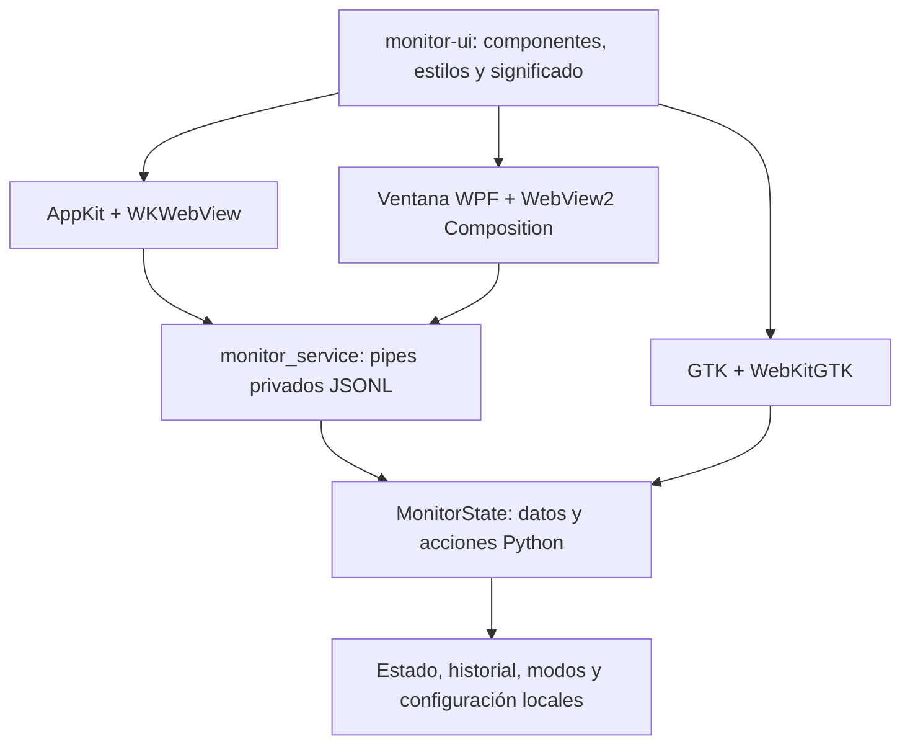

# Una interfaz y un contrato de datos

La decisión aprobada el 03/10/2026 concentra el producto en `monitor-ui/`
(HTML/CSS/JS y Lucide) y en `monitor_state.py` (estado y acciones). Los tres
sistemas muestran los mismos componentes de Agentes, Historial, Consumo,
Ajustes y cápsula. Tauri no forma parte de esta migración.

La ventana nativa mantiene bandeja, posición, altura, primer clic, hover,
región interactiva y custodia de claves: Keychain en Mac, DPAPI en Windows y
Secret Service en Linux. El cristal nativo de Mac sigue usando AppKit;
Windows/Linux usan la superficie CSS transparente. La transparencia no
acredita blur del escritorio en esos dos sistemas. Wayland conserva sus
restricciones de posicionamiento y bandeja, descritas en la guía Linux.

## Datos y rendimiento

`MonitorState` proyecta los mismos contadores, cuota, agentes, configuración
permitida y modos en los tres hosts. Excluye claves, rutas de Python y campos
privados de JEV de la configuración enviada a la interfaz. Las claves se
escriben solo en el adaptador nativo; el servicio no acepta una acción `secret`.
No se registran las cargas del pipe ni errores internos.

El historial se carga al abrir Historial/Consumo, con revisión confirmada por
el host. Su cache común lee solo bytes añadidos, retiene líneas parciales e
invalida tras rotación, truncado, borrado o cambios de igual tamaño. Un error
transitorio de lectura conserva la última vista. Agentes/cápsula no reproducen
el historial; los ACK de modo son nativos e inmediatos. En Linux se usa la misma
clase directamente en el executor; Mac y Windows la usan mediante un hijo
Python y stdin/stdout privados, sin servidor HTTP.

El identificador de transporte `requestId` no sustituye el `id` de una decisión
al guardar valoraciones. Los módulos Python exclusivos del monitor quedan fuera
de la huella del motor: cambios futuros de UI no piden reiniciar Desktop.

El protocolo limita cada petición a 64 KiB y cada respuesta a 64 MiB; valida
IDs, acciones y tipos. Si el historial supera ese límite muestra un aviso y
requiere exportar evidencia para analizarlo: no afirma haberlo mostrado entero.
Los hosts cierran/reintentan su propio hijo tras EOF/error, conservando la vista,
y limitan esperas a 15 s (110 s para conexión). La configuración, valoraciones
y modos se escriben mediante los locks/operaciones atómicas comunes.

## Windows y distribución

`MonitorWindows.cs` sustituye como entrada activa al renderizador WPF anterior.
`build.ps1` ya no compila `MonitorWpf.cs`, `MonitorAgents.cs`, `MonitorAnalytics.cs`,
`MonitorPhases.cs`, `MonitorReviewTests.cs` ni `MonitorIcons.cs`; estos archivos
históricos se preservan porque contenían cambios locales anteriores.

Requisitos: **.NET Framework 4.8** y **WebView2 Runtime Evergreen**. El SDK
Microsoft.Web.WebView2 **1.0.4258.31** queda fijado por SHA-256 en
`tools/webview2-sdk.lock.json`; `tools/webview2_sdk.py` descarga de NuGet oficial
si falta y verifica el paquete y todos los archivos reutilizados. No instala
herramientas globales. El runtime se instala desde
[Microsoft WebView2](https://developer.microsoft.com/microsoft-edge/webview2/).
La estructura de loaders por arquitectura sigue la
[distribución oficial](https://learn.microsoft.com/microsoft-edge/webview2/concepts/distribution).

La interfaz Windows se sirve mediante un host virtual local, con CSP, assets
permitidos, perfil privado, navegación/marcos/popups/descargas/permisos
bloqueados y sin objetos nativos expuestos. Los mensajes solo se aceptan desde
la página principal exacta. El ZIP incluye DLL/loader/UI y el servicio Python
congelado; no necesita Python instalado ni contiene estado del usuario.

## Validación

- Regresiones Python prueban el cache de 35.000 registros, igualdad de datos y
  contadores por plataforma, aislamiento de claves, locks y pipe hijo real.
- Las pruebas del navegador prueban componentes compartidos y el canal Windows
  `window.chrome.webview.postMessage`, incluyendo ACK, historial y ajustes.
- `tests/compile_wpf.py` verifica tipos/enlaces de las fuentes activas contra
  Framework 4.8 y SDK fijado; **no ejecuta Windows**.
- `tests/probe_mac_glass.py` prueba la ventana AppKit/WebKit real con un servicio
  hijo y datos sintéticos. No sustituye la aceptación visual del propietario.
- Windows CI ejecuta `--self-test`: fixture aislado, controles compartidos,
  píldoras, carga incremental, ACK y captura PNG sintética. Preparar este flujo
  o compilarlo desde Mac **no prueba que la CI o Windows hayan pasado**.

**WPF solo necesita validación si vas a usar Windows.** Antes de aceptar esa
plataforma, ejecuta `build.ps1 -BuildOnly`, `dist/codex-monitor-v24.exe --self-test`
y comprueba primer clic/hover con Desktop activo, cambios rápidos de modo,
bandeja, cierre/reapertura, dos DPI/monitores y guardar/leer una clave DPAPI.
En Ubuntu quedan la ventana GTK real, bandeja/posicionamiento X11/Wayland y
Secret Service. No se realizan inferencias, cambios de política ni llamadas
JEV para verificar esta migración.
