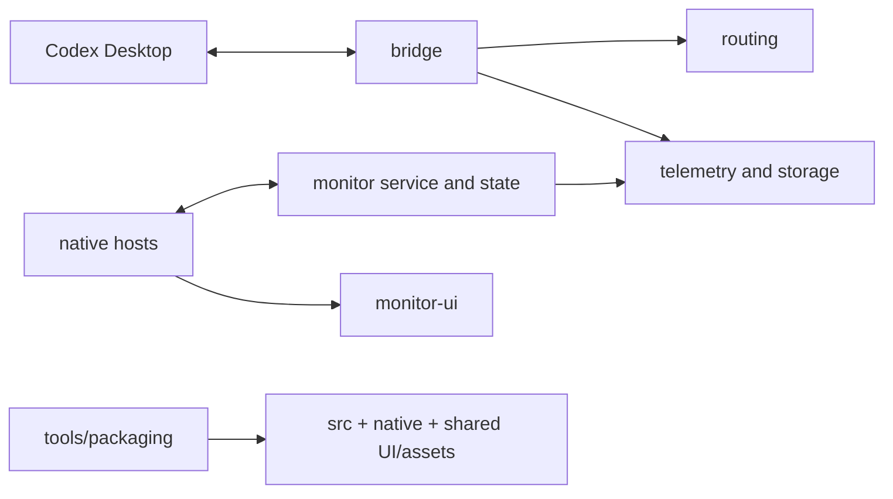

# Source layout

Shared application code lives in `src/codex_model_router/`. Native hosts and
packaging live outside that package. This is organization by responsibility;
existing cross-component dependencies and routing behavior are preserved.

| Directory | Responsibility |
| --- | --- |
| `src/codex_model_router/bridge/` | Protocol forwarding, dispatch, phase control and observed activity |
| `src/codex_model_router/routing/` | Local/JEV decisions, models, workload and task-mode policy |
| `src/codex_model_router/telemetry/` | Inference attribution, usage, diagnostics and safe evidence |
| `src/codex_model_router/monitor/` | Shared monitor state/actions, JSONL service and GTK host |
| `src/codex_model_router/platforms/` | Desktop discovery/connection, resource/data layout, setup, migration and key custody |
| `src/codex_model_router/storage/` | Durable records, thread catalog and history recovery |
| `src/codex_model_router/evaluation/` | Outcome/trial evaluation and candidate-policy controls |
| `native/macos/`, `native/windows/` | AppKit/Swift and Windows/WPF C# sources |
| `monitor-ui/` | Shared HTML/CSS/JS, companions and fonts for all three hosts |
| `tools/packaging/` | Builders, source snapshot, frozen entrypoint, dependency pins and Inno Setup recipe |
| `tools/`, `tests/`, `assets/`, `docs/` | Development tools, checks/fixtures, licensed assets and documentation |

Package-level `build_identity.py`, `packaged_main.py`, `paths.py` and `updates.py`
provide application-wide identity, dispatch, resources and updates.
Older Windows C# views remain preserved under `native/windows/`; the active build
selects `MonitorWindows.cs`, `WindowsLayout.cs` and `WindowsOnboarding.cs`.
It does not compile every C# file in that directory.



## Entry points and compatibility

The root contains project metadata and `run.py`, plus six small compatibility
launchers: `router.py`, `desktop.py`, `macos.py`, `linux.py`, `monitor_service.py`
and `monitor_linux.py`. Existing source-backed shortcuts keep their paths.
`build.ps1` forwards its original parameters to `tools/packaging/build_windows.ps1`.
These files contain no duplicated application logic.

```sh
python3 run.py macos doctor
python3 run.py evidence export --source state --output sample.zip --platform macos
python3 run.py policy status
python3 tools/packaging/package_macos.py --python /path/to/build-python --output release
python3 tools/packaging/build_linux_package.py --output release/linux
python3 -m unittest discover -s tests -p 'test_*.py'
python3 tests/evaluate_routing.py
npm test
npm run test:layout
```

Imports use qualified names, for example
`from codex_model_router.routing.routing import DEFAULT_ROUTES`. Launchers, tools
and tests add the checkout's `src` directory explicitly; no global Python path or
installation is needed. External scripts importing former root implementation
modules must adopt the qualified names and add `src` to their import path.
Dated receipts retain their original paths.

## Resources, data and snapshots

Moving Python files does not move `VERSION`, `config.local.json`, `state/`, assets
or shared UI. Source resources resolve to the checkout root, independently of cwd
or package nesting. Installed apps retain their owned
`Resources/application.json` manifest and established per-user data locations.

Mac/Windows builders snapshot the new source structure. Frozen runtimes analyze
the static `tools/packaging/runtime_entry.py`, with `src` on the analysis path and
a generated build stamp. Ubuntu packages put the package under `Resources/src/`;
the isolated Python launcher loads `codex_model_router.packaged_main` from there.
Private config/state, Git metadata and previous build outputs are excluded.

Fingerprints cover the relocated sources and frozen entrypoint. Monitor-only
edits remain separate from the router fingerprint. Reorganization changes build
identities; it does not replace an active installation, reload a running bridge
or close a native acceptance gate.

See [the validation receipt](native-validation/2026-10-08-source-layout.md) and
[HANDOFF.md](HANDOFF.md) for checks and remaining host acceptance.
