# Animaciones de los personajes

26 GIFs del renderizado real del monitor con datos sintéticos. Cada uno compara el personaje grande (142 px) y la cápsula (38 px).

[Abrir la galería visual](index.html) · [Contrato de actividad](../../COMPANION-ACTIVITY.md)

Usa el número o la clave para pedir cambios, por ejemplo: **03 Pensando** o **thinking**. Los gestos únicos y las transiciones se repiten en el GIF para revisarlos; en la app se ejecutan una vez. Reposo, espera y desconexión incluyen sus movimientos suaves. El cuerpo y los objetos conservan su forma.

Los bucles cubren un ciclo completo de todos los movimientos combinados, incluido el parpadeo. El código de producción determina la duración; no se acelera el movimiento.

## Índice

| Nº | Animación | Clave | Tipo |
| --- | --- | --- | --- |
| 01 | [Preparando turno](#preparing) | `preparing` | Bucle |
| 02 | [Trabajando](#working) | `working` | Bucle |
| 03 | [Pensando](#thinking) | `thinking` | Bucle |
| 04 | [Planificando](#planning) | `planning` | Bucle |
| 05 | [Escribiendo](#writing) | `writing` | Bucle |
| 06 | [Ejecutando comandos](#executing) | `executing` | Bucle |
| 07 | [Editando archivos](#editing) | `editing` | Bucle |
| 08 | [Buscando en la web](#searching) | `searching` | Bucle |
| 09 | [Usando una herramienta](#tool) | `tool` | Bucle |
| 10 | [Colaborando](#collaborating) | `collaborating` | Bucle |
| 11 | [Observando una imagen](#inspecting) | `inspecting` | Bucle |
| 12 | [Generando una imagen](#generating) | `generating` | Bucle |
| 13 | [Revisando](#reviewing) | `reviewing` | Bucle |
| 14 | [Compactando contexto](#compacting) | `compacting` | Bucle |
| 15 | [Esperando aprobación](#approval) | `approval` | Bucle |
| 16 | [Esperando tu respuesta](#question) | `question` | Bucle |
| 17 | [Reintentando](#retrying) | `retrying` | Bucle |
| 18 | [Error](#error) | `error` | Gesto único |
| 19 | [Turno interrumpido](#interrupted) | `interrupted` | Gesto único |
| 20 | [Turno terminado](#done) | `done` | Gesto único |
| 21 | [Entrada del personaje](#enter) | `enter` | Transición |
| 22 | [Salida del personaje](#leave) | `leave` | Transición |
| 23 | [En reposo](#idle) | `idle` | Bucle |
| 24 | [Actividad sin confirmar](#unknown) | `unknown` | Bucle |
| 25 | [Sin conexión](#offline) | `offline` | Bucle |
| 26 | [Espera genérica · compatibilidad](#waiting) | `waiting` | Bucle |

<a id="preparing"></a>

## 01 · Preparando turno

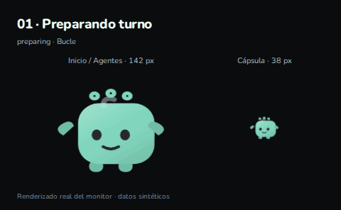

`preparing` · Bucle · 4 s

<a id="working"></a>

## 02 · Trabajando

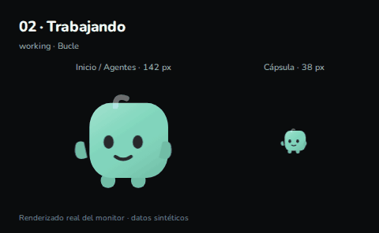

`working` · Bucle · 4 s

<a id="thinking"></a>

## 03 · Pensando

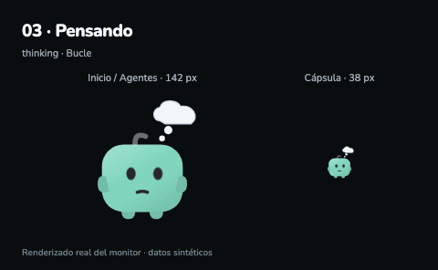

`thinking` · Bucle · 4 s

<a id="planning"></a>

## 04 · Planificando

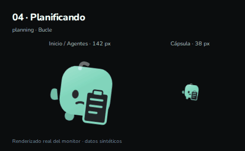

`planning` · Bucle · 4 s

<a id="writing"></a>

## 05 · Escribiendo

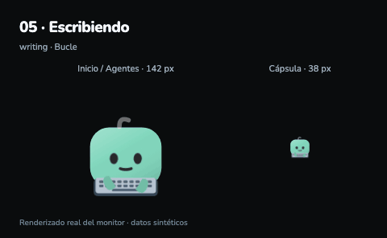

`writing` · Bucle · 4 s

<a id="executing"></a>

## 06 · Ejecutando comandos


`executing` · Bucle · 4 s

<a id="editing"></a>

## 07 · Editando archivos

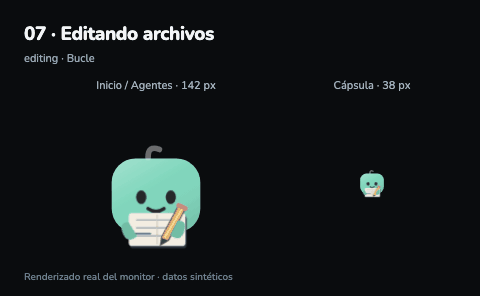

`editing` · Bucle · 4 s

<a id="searching"></a>

## 08 · Buscando en la web

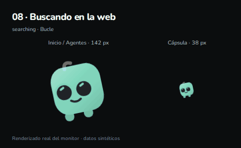

`searching` · Bucle · 4 s

<a id="tool"></a>

## 09 · Usando una herramienta

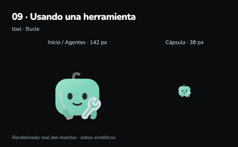

`tool` · Bucle · 4 s

<a id="collaborating"></a>

## 10 · Colaborando

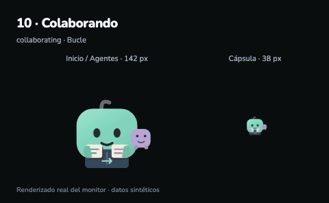

`collaborating` · Bucle · 4 s

<a id="inspecting"></a>

## 11 · Observando una imagen

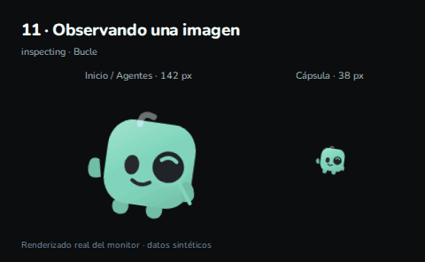

`inspecting` · Bucle · 4 s

<a id="generating"></a>

## 12 · Generando una imagen

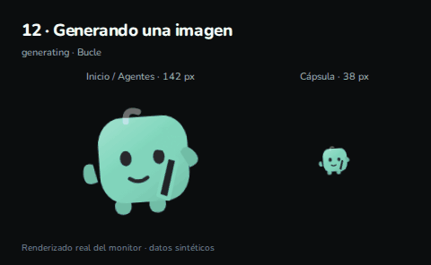

`generating` · Bucle · 4 s

<a id="reviewing"></a>

## 13 · Revisando


`reviewing` · Bucle · 4 s

<a id="compacting"></a>

## 14 · Compactando contexto

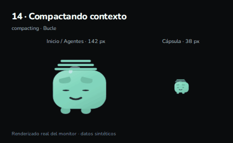

`compacting` · Bucle · 4 s

<a id="approval"></a>

## 15 · Esperando aprobación


`approval` · Bucle · 4 s

<a id="question"></a>

## 16 · Esperando tu respuesta

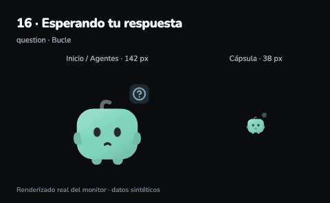

`question` · Bucle · 4 s

<a id="retrying"></a>

## 17 · Reintentando

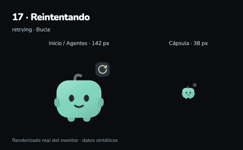

`retrying` · Bucle · 4 s

<a id="error"></a>

## 18 · Error

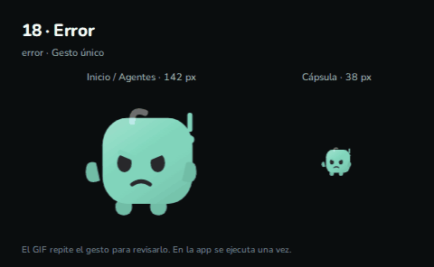

`error` · Gesto único · 2.4 s

<a id="interrupted"></a>

## 19 · Turno interrumpido

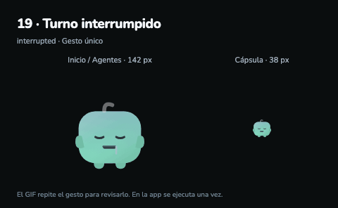

`interrupted` · Gesto único · 2.4 s

<a id="done"></a>

## 20 · Turno terminado

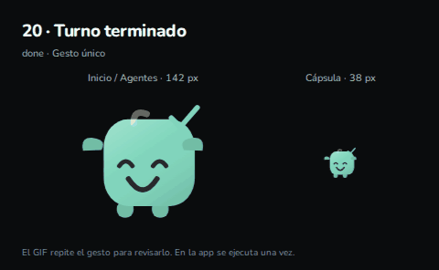

`done` · Gesto único · 2.4 s

<a id="enter"></a>

## 21 · Entrada del personaje

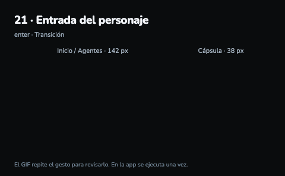

`enter` · Transición · 2.4 s

<a id="leave"></a>

## 22 · Salida del personaje

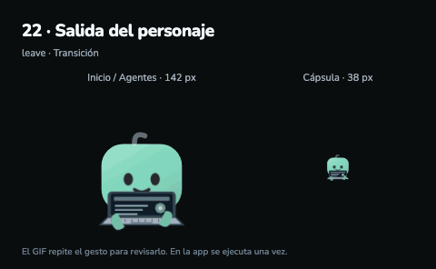

`leave` · Transición · 2.4 s

<a id="idle"></a>

## 23 · En reposo

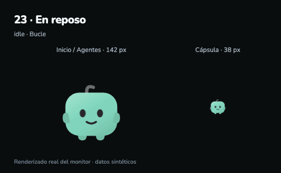

`idle` · Bucle · 4 s

<a id="unknown"></a>

## 24 · Actividad sin confirmar

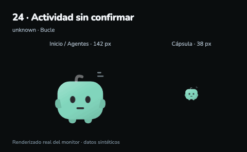

`unknown` · Bucle · 4 s

<a id="offline"></a>

## 25 · Sin conexión

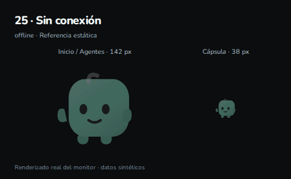

`offline` · Bucle · 4 s

<a id="waiting"></a>

## 26 · Espera genérica · compatibilidad

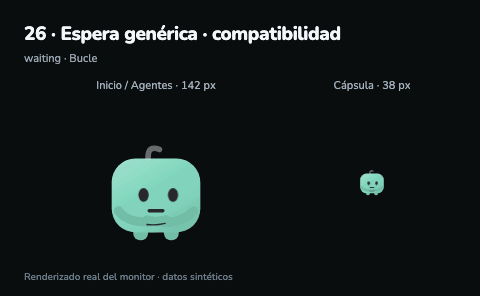

`waiting` · Bucle · 4 s


## Regenerar después de corregir una animación

Requiere las dependencias Node del proyecto, Chromium de Playwright y Python con Pillow. No accede a datos personales ni a Desktop.

```sh
node tools/render_companion_gifs.cjs           # todos
node tools/render_companion_gifs.cjs thinking # solo Pensando
# Si Pillow está en un entorno virtual:
ROUTER_GIF_PYTHON=/ruta/al/venv/bin/python node tools/render_companion_gifs.cjs
```

Los GIFs y el índice se guardan en esta carpeta. `manifest.json` registra las animaciones, tiempos y hashes del código renderizado.
